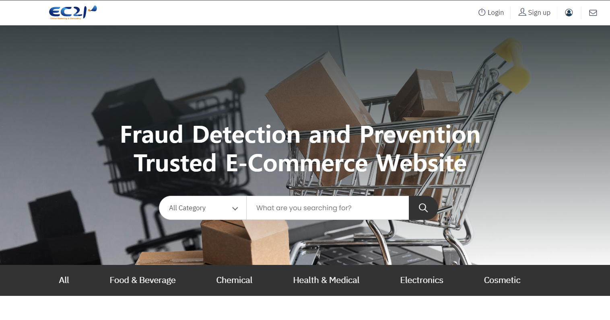
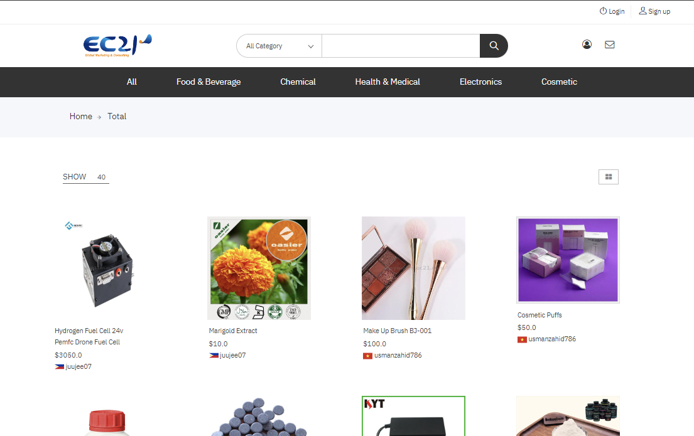
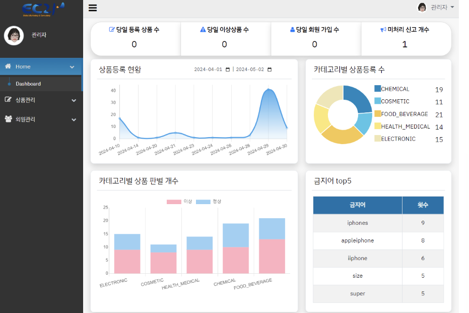
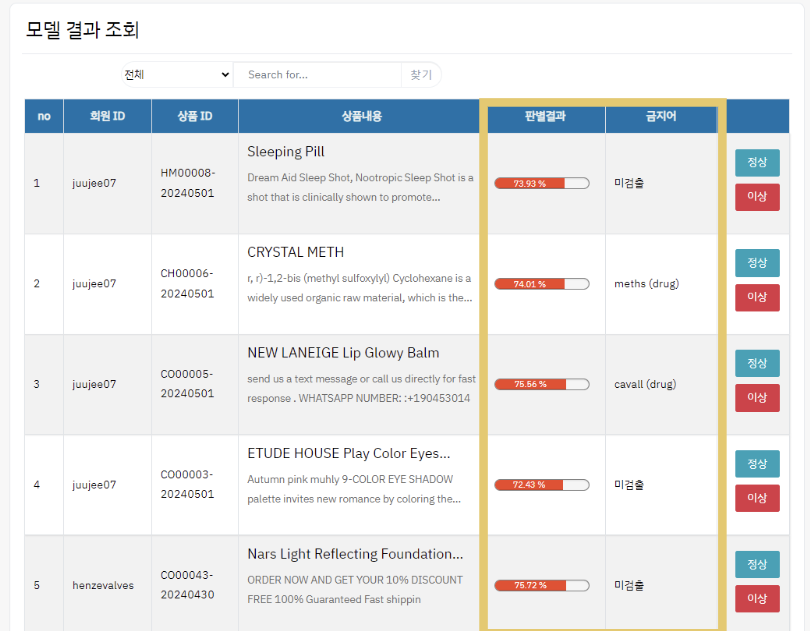
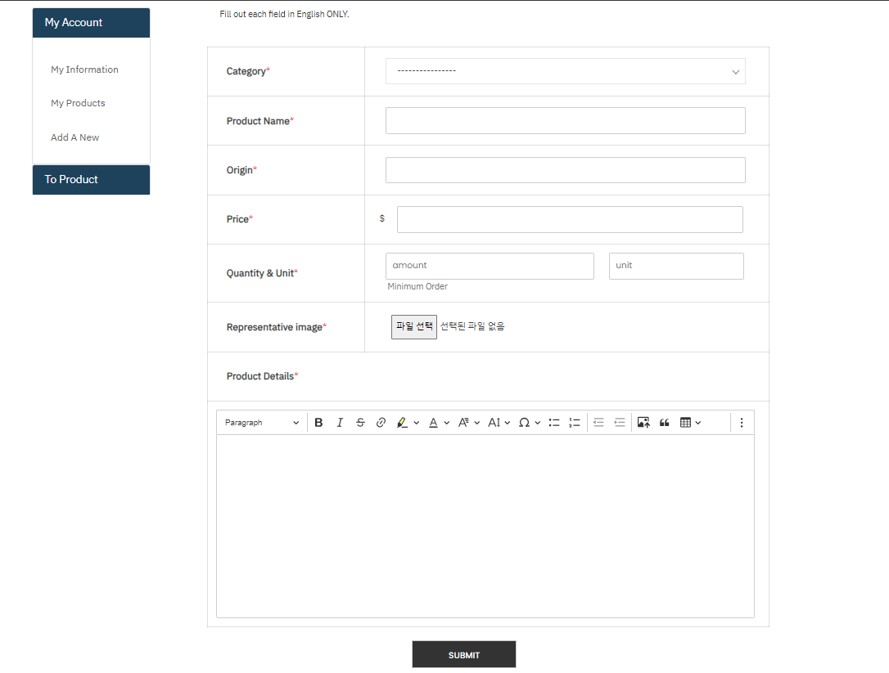
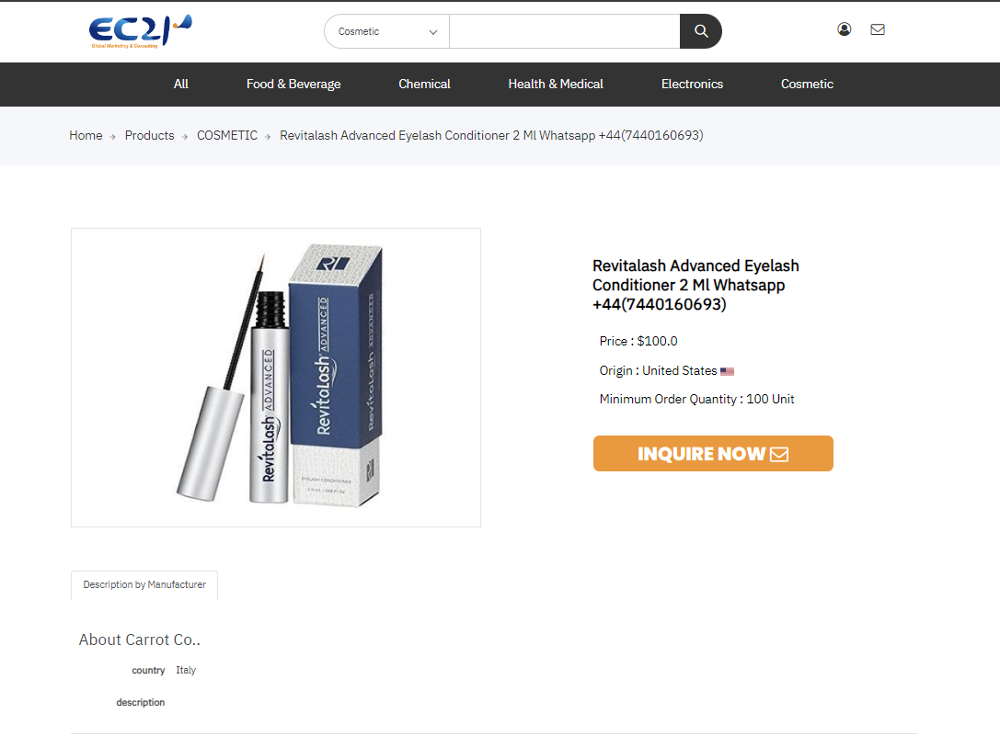
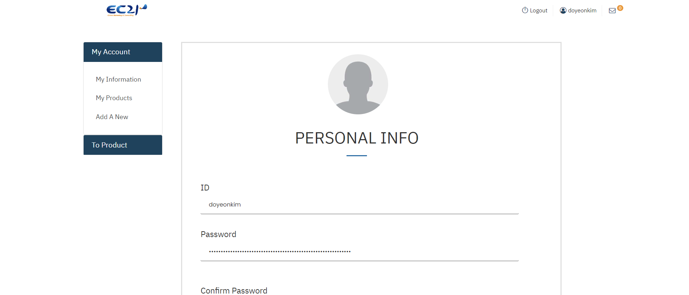
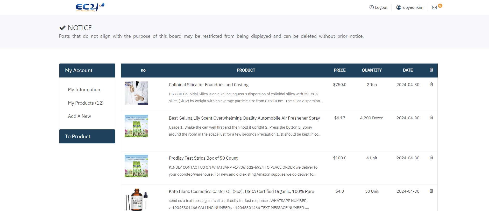
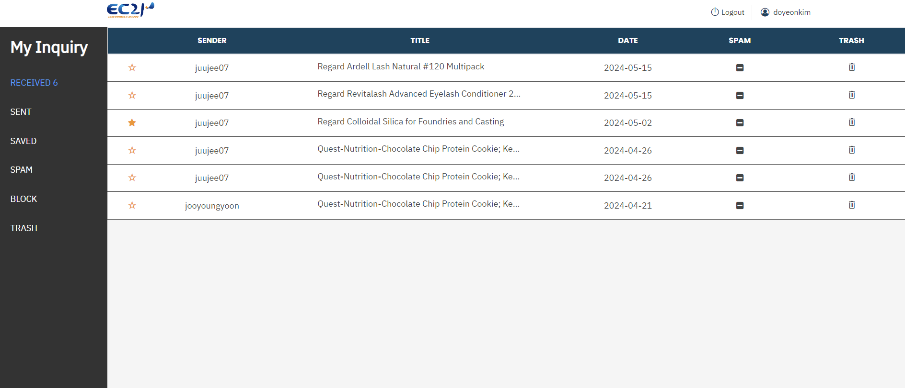
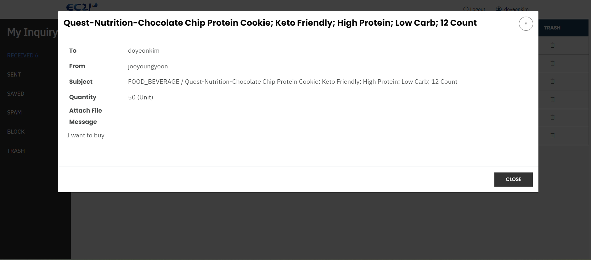

# B2B 마켓플레이스 이상상품 판별 웹

### 한국 무역협회 디지털 마스터 과정 3기 2차 웹 프로젝트

이 프로젝트는 전자상거래 플랫폼으로, 사용자가 상품을 등록하고, 조회하며, 구매할 수 있는 기능을 제공합니다. 그리고 관리자가 이상상품 판별 모델 결과와 문자열 유사도 결과를 토대로, 보다 정확하고 효과적으로 상품을 관리할 수 있는 기능을 제공합니다. 

 

## 💻 프로젝트 개요
- 개발 기간 : 2024.04 ~ 2024.05.03 (1개월)
- 협업 기업 : EC21 (http://www.ec21.co.kr/)
- 개발 인원 : 4명 (김도연, 김인영, 김희진, 윤주영)
- 개발 목적 🔎
    1. 상품 등록 시 이상 탐지 기능으로 신뢰도 높은 e-마켓플레이스 구현
    2. 상품 및 회원 관리의 편의 증진을 위한 관리자 페이지 구현
- 담당 역할 ⭐️
    - DB 관리
    - 백엔드
        - Spring Security 기능 구현
        - 인콰이어리 관련 기능 구현 (recieved/sent/saved/block/trash)
        - 회원관련 기능 구현 (회원 정보 확인, 등록 상품 목록)
        - 상품관련 기능 구현 (상품 등록, 상품 수정)
        - 관리자페이지 기능 구현
    - 프론드엔드 
        - 각 페이지 별 Thymeleaf 문법 구현
        - 각 페이지 별 JQeury 코드 작성

 

## ⚙️ 개발 환경

### 🚀 Stacks 
- Java 17
- Python 3.11
    - FastAPI
- HTML 5, CSS 3, JavaScript ES6, JQuery, Thymeleaf 3.6 
- Oracle 19

### 🛠 Tools
- VSCode, 
- SpringBoot 3.4, 
- Github

 

## 아키텍쳐

 

## 메인 기능
### ⭐️ 이상 상품 판별 
- 파이썬으로 개발한 딥러닝 분류 모델(LSTM)과 문자열 유사도(rapid Fuzzy)를 FastAPI 서버로 구현하여 스프링 서버와 연결
    - LSTM 모델 : 협업기업에서 받은 데이터들을 학습시킴 (정상상품 데이터 6만개, 이상상품 데이터 6만개)
    - Rapid Fuzzy : 협업기업에서 받은 금지어 목록을 기반으로 문자열 유사도 측정
- 사용자가 상품 등록 시 "상품명"과 "상품설명"을 모델의 입력값으로 전달하고, 판별 결과에 따라 다르게 처리
    - 이상 판별 시, ① 관리자 판단 후 ② 상품 게시 or 이상 상품 처리
    - 정상 판별 시, 웹 페이지에 상품 게시

 

## 화면 구성

| 메인 페이지 |  |
| ---- | ---- |
|  |  |
| 관리자 |  |
|  |   |
| 상품  ||
|  |   |
| 회원 |  |
|  |   |
| 인콰이어리 |  |
|  |   |

